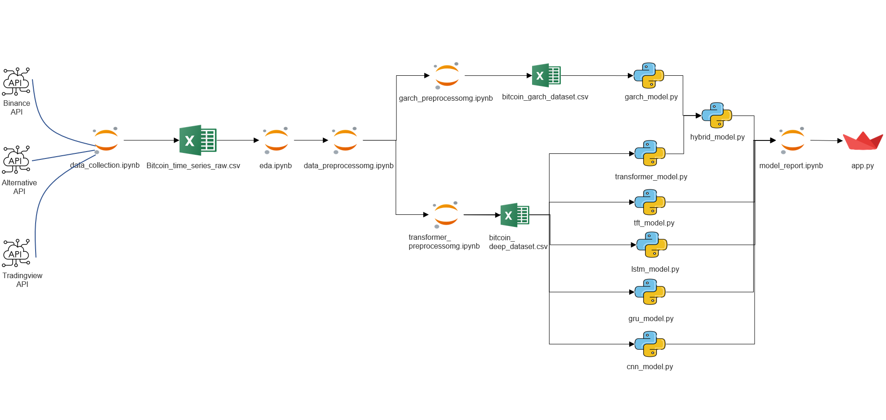
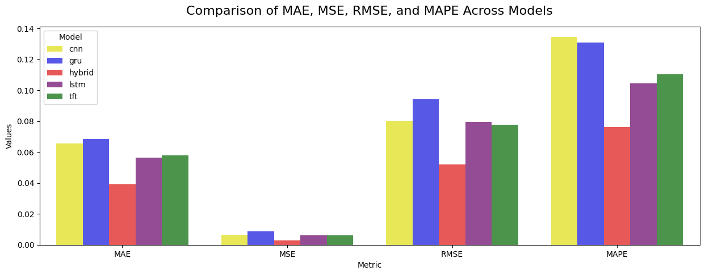
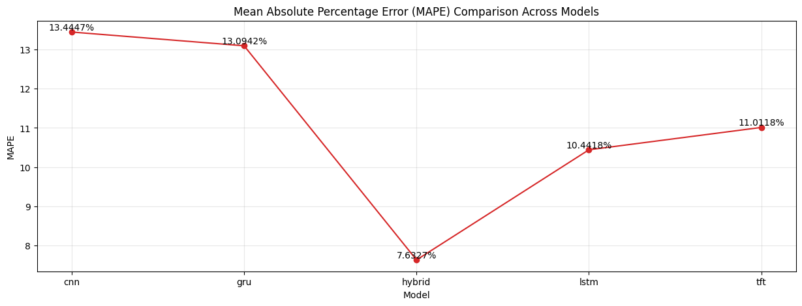
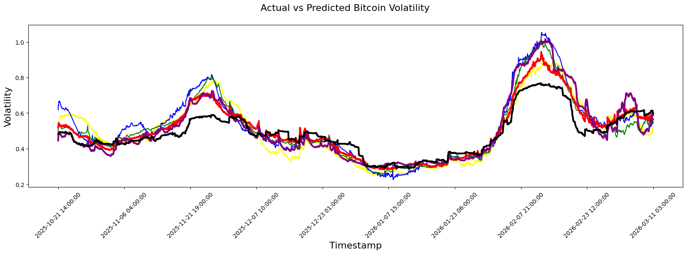

# 🤖 Bitcoin-Volatility-Time-Series-Forecasting

## ✒️ 1. Giới thiệu về tác giả

- **Tên:** Nguyễn Khắc Hưng
- **Vị trí:** Data Scientist
- **Học vấn:** Đang theo học chương trình Kỹ sư ngành Khoa học Dữ liệu, chuyên ngành Phân tích Dữ liệu trong Kinh tế và Tài chính, thuộc khoa Công nghệ Thông tin, Trường Đại học Mỏ - Địa chất.

---

## 🌟 2. Tổng quan về dự án

Đây là dự án phân tích dữ liệu chuỗi thời gian trong lĩnh vực Kinh tế và Tài chính, được nghiên cứu và phát triển trong khuôn khổ cuộc thi Nghiên cứu Khoa học Sinh viên thường niên tại trường Đại học năm học 2025 - 2026. Dự án đã xuất sắc đạt **giải Nhất** cấp Trường với số điểm **92/100**.

Dự án tập trung nghiên cứu và xây dựng 5 mô hình Học sâu (Deep Learning) hiện đại và mạnh mẽ nhất hiện nay: **LSTM, GRU, CNN, TFT** và **HYBRID (TRANSFORMER & GARCH)**. Qua quá trình thử nghiệm và so sánh kết quả thực nghiệm, nhóm nhận thấy mô hình lai **HYBRID (TRANSFORMER & GARCH)** mang lại độ chính xác vượt trội hơn hẳn so với 4 mô hình độc lập còn lại.

Nhóm nghiên cứu đã ứng dụng mô hình tốt nhất này để giải quyết bài toán thực tế của doanh nghiệp: **Ký quỹ cho vay trong đầu tư Bitcoin** (bài toán quản trị rủi ro mà CEO của Binance - CZ thường xuyên đề cập). Dự án thuộc lĩnh vực **Finance / FinTech**.

Dữ liệu sử dụng trong dự án là dữ liệu thực tế 100%, được thu thập tự động qua API từ 3 nguồn chính:

- **Binance API**
- **Alternative.me API**
- **TradingView API**

Bộ dữ liệu bao gồm gần **80.000 bản ghi** (dòng dữ liệu) với **16 cột đặc trưng**.

---

## 📂 3. Cấu trúc thư mục dự án

```text
Dự án_AI: Building_a_Hybrid_Machine_Learning_Model_for_Bitcoin_Volatility_Prediction_in_the_Global_Crypto_Market/
│
├── data/                             # Thư mục quản lý dữ liệu
│   ├── processed/                    # Dữ liệu đã qua tiền xử lý, sẵn sàng train
│   │   └── Bitcoin_time_series_processed.csv
│   └── raw/                          # Dữ liệu thô gốc thu thập từ các nguồn (Sàn/API)
│       └── Bitcoin_time_series_raw.csv
│
├── images/                           # Thư mục lưu trữ hình ảnh minh họa, báo cáo, video demo và sơ đồ
│   ├── demo.mp4                      # Video demo chạy ứng dụng Dashboard Streamlit
│   ├── Bitcoin-Volatility-Time-Series-Forecasting.pdf
│   ├── MAPE.png
│   ├── actutal_prediction.png
│   ├── ai_circuits_dribbble.gif
│   ├── comparison_MAE_MSE_RMSE_MAPE.png
│   ├── garch.png
│   └── schema.png
│
├── notebooks/                        # Không gian nghiên cứu (Jupyter Notebooks)
│   ├── data_analyst/                 # Khối phân tích dữ liệu khám phá (EDA)
│   │   ├── eda.ipynb
│   │   └── Hybrid_Model_Report.ipynb # Notebook tổng hợp báo cáo so sánh các mô hình
│   ├── data_collection/              # Khối cào và thu thập dữ liệu tự động
│   │   └── data_collection.ipynb
│   └── data_preprocessing/           # Khối tiền xử lý và làm sạch dữ liệu
│       ├── data_preprocessing.ipynb
│       ├── garch_preprocessing.ipynb
│       └── transformer_preprocessing.ipynb
│
├── src/                              # Mã nguồn chính của dự án (Production Code)
│   ├── app/                          # Khối ứng dụng Web/Dashboard (Streamlit)
│   │   ├── app.py                    # File chạy giao diện UI chính
│   │   └── transformer_model.py      # File chứa class mô hình để import vào app
│   │
│   ├── models/                       # Khối định nghĩa kiến trúc và suy luận (Inference)
│   │   ├── cnn_model/
│   │   │   ├── cnn.py                # Kiến trúc mạng Deep CNN 1D
│   │   │   └── inference_cnn.py      # Script chạy dự đoán thực tế cho CNN
│   │   ├── gru_model/
│   │   │   ├── gru.py                # Kiến trúc mạng Ultra-Simple GRU
│   │   │   └── inference_gru.py      # Script chạy dự đoán thực tế cho GRU
│   │   ├── hybrid_model/             # Cụm mô hình lõi: Hybrid GARCH-Transformer
│   │   │   ├── garch_model.py        # Script mô hình thống kê GARCH
│   │   │   ├── transformer_model.py  # Kiến trúc mạng Neural Transformer
│   │   │   ├── merge_garch_feature.py # Script gộp đặc trưng (Early Fusion Pipeline)
│   │   │   └── inference_transformer.py # Script chạy dự đoán thực tế cho Transformer
│   │   ├── lstm_model/
│   │   │   ├── lstm.py               # Kiến trúc mạng Advanced Bi-LSTM
│   │   │   └── inference_lstm.py     # Script chạy dự đoán thực tế cho LSTM
│   │   └── tft_model/
│   │       ├── tft.py                # Kiến trúc mạng Lite Temporal Fusion Transformer
│   │       └── inference_tft.py      # Script chạy dự đoán thực tế cho TFT
│   │
│   └── utils/                        # Khối hàm tiện ích dùng chung
│       └── gridSearch_hungdeptraikt.py # Script tối ưu hóa siêu tham số (Hyperparameter tuning)
│
├── README.md                         # Tài liệu giới thiệu tổng quan dự án (Markdown)
└── requirements.txt                  # Danh sách các thư viện và dependencies cần cài đặt
```

---

## 🏗️ 4. Kiến trúc dự án

<p align="center">
  
</p>
<p align="center">
  <em>Sơ đồ kiến trúc hệ thống (Xem ảnh gốc cục bộ tại: <a href="file:///C:/Python/Data_Science_Atifficial_Interligent/project_datascience%20_AI/Data_Analsys/Building_a_Hybrid_Machine_Learning_Model_for_Bitcoin_Volatility_Prediction_in_the_Global_Crypto_Market%20-%20Copy/images/schema.png">schema.png</a>)</em>
</p>

**Giải thích kiến trúc và mô tả luồng hoạt động:**

Trong sơ đồ kiến trúc của dự án dự đoán biến động giá Bitcoin:

- **Luồng 1 (Thu thập dữ liệu):** Dữ liệu được thu thập tự động bằng Python ([data_collection.ipynb](file:///C:/Python/Data_Science_Atifficial_Interligent/project_datascience%20_AI/Data_Analsys/Building_a_Hybrid_Machine_Learning_Model_for_Bitcoin_Volatility_Prediction_in_the_Global_Crypto_Market%20-%20Copy/notebooks/data_collection/data_collection.ipynb)) thông qua API của Binance, Alternative.me và TradingView, sau đó lưu dưới dạng `.csv` tại thư mục dữ liệu thô.
- **Luồng 2 (Phân tích khám phá - EDA):** Phân tích dữ liệu khám phá và phân tích chuỗi thời gian để tìm ra các điểm bất thường, xu hướng và đặc điểm của dữ liệu ([eda.ipynb](file:///C:/Python/Data_Science_Atifficial_Interligent/project_datascience%20_AI/Data_Analsys/Building_a_Hybrid_Machine_Learning_Model_for_Bitcoin_Volatility_Prediction_in_the_Global_Crypto_Market%20-%20Copy/notebooks/data_analyst/eda.ipynb)).
- **Luồng 3 (Tiền xử lý):** Tiến hành làm sạch dữ liệu ([data_preprocessing.ipynb](file:///C:/Python/Data_Science_Atifficial_Interligent/project_datascience%20_AI/Data_Analsys/Building_a_Hybrid_Machine_Learning_Model_for_Bitcoin_Volatility_Prediction_in_the_Global_Crypto_Market%20-%20Copy/notebooks/data_preprocessing/data_preprocessing.ipynb)) bao gồm xử lý giá trị khuyết thiếu (NaN), giá trị trùng lặp và chuyển đổi kiểu dữ liệu.
- **Luồng 4 (Trích xuất đặc trưng chuyên sâu):** Thực hiện tiền xử lý đặc trưng cho mô hình thống kê GARCH ([garch_preprocessing.ipynb](file:///C:/Python/Data_Science_Atifficial_Interligent/project_datascience%20_AI/Data_Analsys/Building_a_Hybrid_Machine_Learning_Model_for_Bitcoin_Volatility_Prediction_in_the_Global_Crypto_Market%20-%20Copy/notebooks/data_preprocessing/garch_preprocessing.ipynb)) và mô hình Transformer ([transformer_preprocessing.ipynb](file:///C:/Python/Data_Science_Atifficial_Interligent/project_datascience%20_AI/Data_Analsys/Building_a_Hybrid_Machine_Learning_Model_for_Bitcoin_Volatility_Prediction_in_the_Global_Crypto_Market%20-%20Copy/notebooks/data_preprocessing/transformer_preprocessing.ipynb)), sau đó xuất dữ liệu đã xử lý ra các file `.csv` phục vụ quá trình huấn luyện mô hình.
- **Luồng 5 (Xây dựng mô hình):** Thiết kế và huấn luyện 5 mô hình deep learning bao gồm: TFT, LSTM, CNN, GRU và mô hình lai HYBRID (TRANSFORMER & GARCH).
- **Luồng 6 (Đánh giá hiệu năng):** So sánh hiệu quả dự đoán của 5 mô hình trên dữ liệu thực tế thông qua 3 chỉ số chính: **MAE, MSE, RMSE**, để lựa chọn ra mô hình tốt nhất.
- **Luồng 7 (Triển khai ứng dụng):** Đóng gói mô hình tối ưu nhất và triển khai giao diện tương tác trực tuyến qua Streamlit ([app.py](file:///C:/Python/Data_Science_Atifficial_Interligent/project_datascience%20_AI/Data_Analsys/Building_a_Hybrid_Machine_Learning_Model_for_Bitcoin_Volatility_Prediction_in_the_Global_Crypto_Market%20-%20Copy/src/app/app.py)) nhằm giải quyết bài toán ký quỹ thực tế cho doanh nghiệp.

---

## 🛠️ 5. Công nghệ sử dụng (Tech Stack)

- **IDE/Môi trường:** Visual Studio Code, Jupyter Notebook
- **Ngôn ngữ lập trình:** Python
- **Thư viện chính:**
  - _Xử lý & Phân tích dữ liệu:_ `pandas`, `numpy`, `scikit-learn`
  - _Trực quan hóa đồ thị:_ `matplotlib`, `seaborn`, `plotly`
  - _Học sâu & Thống kê:_ `PyTorch` (`torch`), `arch` (cho mô hình GARCH)
  - _Ứng dụng Web Dashboard:_ `Streamlit`, `joblib`, `pickle`, `os`

---

## 📊 6. Tổng quan về dữ liệu

Tập dữ liệu [Bitcoin_time_series_raw.csv](file:///C:/Python/Data_Science_Atifficial_Interligent/project_datascience%20_AI/Data_Analsys/Building_a_Hybrid_Machine_Learning_Model_for_Bitcoin_Volatility_Prediction_in_the_Global_Crypto_Market%20-%20Copy/data/raw/Bitcoin_time_series_raw.csv) là tập dữ liệu thực tế 100%, được thu thập tự động từ API của 3 nền tảng chính thông qua các thư viện Python chuyên dụng (như `requests`, `tvdatafeed` và `ccxt`):

- **Số dòng (Rows):** 70.666
- **Số cột (Columns):** 16
- **Các nhóm đặc trưng chính (Key Features):**

### 🔹 Nhóm 1: Binance & CCXT

- **Nguồn:** Binance API (BTC/USDT khung thời gian 1 giờ - 1H OHLCV Data)
- **Đặc trưng gốc (Raw Features):**
  - `timestamp`: Thời gian ghi nhận dữ liệu.
  - `open`, `high`, `low`, `close`: Giá mở cửa, cao nhất, thấp nhất, đóng cửa của Bitcoin.
  - `volume`: Khối lượng giao dịch.
- **Đặc trưng tự thiết kế (Engineered Features):**
  - `ATR` (Average True Range): Đo lường biến động giá thị trường.
  - `BB_width_norm`: Độ rộng dải Bollinger Band đã chuẩn hóa.
  - `RSI` (Relative Strength Index): Chỉ số sức mạnh tương đối.
  - `MACD_Hist`: Biểu đồ cột của chỉ số MACD.
  - `MA20` / `EMA20`: Đường trung bình động đơn giản/lũy thừa 20 chu kỳ.

### 🔹 Nhóm 2: Alternative.me & Requests

- **Nguồn:** Crypto Fear & Greed Index (Chỉ số Sợ hãi & Tham lam - CFGI)
- **Đặc trưng chính:**
  - `CFGI`: Giá trị của chỉ số tâm lý thị trường.
  - _Lưu ý:_ API cũng hỗ trợ thêm dữ liệu về phân loại (`CFGI_classification`) và thời gian (`CFGI_timestamp`), nhưng trong mô hình hiện tại dự án chỉ sử dụng thuộc tính chính là `CFGI`.

### 🔹 Nhóm 3: TradingView & tvDatafeed

- **Nguồn:** Macro Market Indicators (Các chỉ số vĩ mô của thị trường Crypto)
- **Đặc trưng chính:**
  - `BTC_D` (Bitcoin Dominance): Tỷ lệ vốn hóa thống trị của Bitcoin.
  - `TOTAL`: Tổng vốn hóa toàn bộ thị trường tiền mã hóa (Total Crypto Market Cap).
  - `USDT.D` (USDT Dominance): Tỷ lệ thống trị của đồng stablecoin USDT.

---

## 🔍 7. Chi tiết về dự án và kết quả thực nghiệm

Dự án cung cấp các notebook nghiên cứu chi tiết và mã nguồn hoàn chỉnh cho từng mô hình:

### 📔 Các Notebook nghiên cứu (Research Notebooks):

- **Cào dữ liệu:** [data_collection.ipynb](file:///C:/Python/Data_Science_Atifficial_Interligent/project_datascience%20_AI/Data_Analsys/Building_a_Hybrid_Machine_Learning_Model_for_Bitcoin_Volatility_Prediction_in_the_Global_Crypto_Market%20-%20Copy/notebooks/data_collection/data_collection.ipynb)
- **Phân tích dữ liệu chuỗi thời gian:** [eda.ipynb](file:///C:/Python/Data_Science_Atifficial_Interligent/project_datascience%20_AI/Data_Analsys/Building_a_Hybrid_Machine_Learning_Model_for_Bitcoin_Volatility_Prediction_in_the_Global_Crypto_Market%20-%20Copy/notebooks/data_analyst/eda.ipynb)
- **Tiền xử lý & làm sạch:** [data_preprocessing.ipynb](file:///C:/Python/Data_Science_Atifficial_Interligent/project_datascience%20_AI/Data_Analsys/Building_a_Hybrid_Machine_Learning_Model_for_Bitcoin_Volatility_Prediction_in_the_Global_Crypto_Market%20-%20Copy/notebooks/data_preprocessing/data_preprocessing.ipynb)
- **Xử lý đặc trưng GARCH:** [garch_preprocessing.ipynb](file:///C:/Python/Data_Science_Atifficial_Interligent/project_datascience%20_AI/Data_Analsys/Building_a_Hybrid_Machine_Learning_Model_for_Bitcoin_Volatility_Prediction_in_the_Global_Crypto_Market%20-%20Copy/notebooks/data_preprocessing/garch_preprocessing.ipynb)
- **Xử lý đặc trưng Transformer:** [transformer_preprocessing.ipynb](file:///C:/Python/Data_Science_Atifficial_Interligent/project_datascience%20_AI/Data_Analsys/Building_a_Hybrid_Machine_Learning_Model_for_Bitcoin_Volatility_Prediction_in_the_Global_Crypto_Market%20-%20Copy/notebooks/data_preprocessing/transformer_preprocessing.ipynb)
- **Báo cáo mô hình Hybrid:** [Hybrid_Model_Report.ipynb](file:///C:/Python/Data_Science_Atifficial_Interligent/project_datascience%20_AI/Data_Analsys/Building_a_Hybrid_Machine_Learning_Model_for_Bitcoin_Volatility_Prediction_in_the_Global_Crypto_Market%20-%20Copy/notebooks/data_analyst/Hybrid_Model_Report.ipynb)

### 💻 Mã nguồn mô hình (Production Code):

- **Mô hình CNN:** [cnn.py](file:///C:/Python/Data_Science_Atifficial_Interligent/project_datascience%20_AI/Data_Analsys/Building_a_Hybrid_Machine_Learning_Model_for_Bitcoin_Volatility_Prediction_in_the_Global_Crypto_Market%20-%20Copy/src/models/cnn_model/cnn.py) | Script suy luận: [inference_cnn.py](file:///C:/Python/Data_Science_Atifficial_Interligent/project_datascience%20_AI/Data_Analsys/Building_a_Hybrid_Machine_Learning_Model_for_Bitcoin_Volatility_Prediction_in_the_Global_Crypto_Market%20-%20Copy/src/models/cnn_model/inference_cnn.py)
- **Mô hình GRU:** [gru.py](file:///C:/Python/Data_Science_Atifficial_Interligent/project_datascience%20_AI/Data_Analsys/Building_a_Hybrid_Machine_Learning_Model_for_Bitcoin_Volatility_Prediction_in_the_Global_Crypto_Market%20-%20Copy/src/models/gru_model/gru.py) | Script suy luận: [inference_gru.py](file:///C:/Python/Data_Science_Atifficial_Interligent/project_datascience%20_AI/Data_Analsys/Building_a_Hybrid_Machine_Learning_Model_for_Bitcoin_Volatility_Prediction_in_the_Global_Crypto_Market%20-%20Copy/src/models/gru_model/inference_gru.py)
- **Mô hình LSTM:** [lstm.py](file:///C:/Python/Data_Science_Atifficial_Interligent/project_datascience%20_AI/Data_Analsys/Building_a_Hybrid_Machine_Learning_Model_for_Bitcoin_Volatility_Prediction_in_the_Global_Crypto_Market%20-%20Copy/src/models/lstm_model/lstm.py) | Script suy luận: [inference_lstm.py](file:///C:/Python/Data_Science_Atifficial_Interligent/project_datascience%20_AI/Data_Analsys/Building_a_Hybrid_Machine_Learning_Model_for_Bitcoin_Volatility_Prediction_in_the_Global_Crypto_Market%20-%20Copy/src/models/lstm_model/inference_lstm.py)
- **Mô hình TFT:** [tft.py](file:///C:/Python/Data_Science_Atifficial_Interligent/project_datascience%20_AI/Data_Analsys/Building_a_Hybrid_Machine_Learning_Model_for_Bitcoin_Volatility_Prediction_in_the_Global_Crypto_Market%20-%20Copy/src/models/tft_model/tft.py) | Script suy luận: [inference_tft.py](file:///C:/Python/Data_Science_Atifficial_Interligent/project_datascience%20_AI/Data_Analsys/Building_a_Hybrid_Machine_Learning_Model_for_Bitcoin_Volatility_Prediction_in_the_Global_Crypto_Market%20-%20Copy/src/models/tft_model/inference_tft.py)
- **Mô hình lai Hybrid (GARCH-Transformer):**
  - Mô hình thống kê GARCH: [garch_model.py](file:///C:/Python/Data_Science_Atifficial_Interligent/project_datascience%20_AI/Data_Analsys/Building_a_Hybrid_Machine_Learning_Model_for_Bitcoin_Volatility_Prediction_in_the_Global_Crypto_Market%20-%20Copy/src/models/hybrid_model/garch_model.py)
  - Mô hình mạng Transformer: [transformer_model.py](file:///C:/Python/Data_Science_Atifficial_Interligent/project_datascience%20_AI/Data_Analsys/Building_a_Hybrid_Machine_Learning_Model_for_Bitcoin_Volatility_Prediction_in_the_Global_Crypto_Market%20-%20Copy/src/models/hybrid_model/transformer_model.py)
  - Pipeline gộp đặc trưng: [merge_garch_feature.py](file:///C:/Python/Data_Science_Atifficial_Interligent/project_datascience%20_AI/Data_Analsys/Building_a_Hybrid_Machine_Learning_Model_for_Bitcoin_Volatility_Prediction_in_the_Global_Crypto_Market%20-%20Copy/src/models/hybrid_model/merge_garch_feature.py)
  - Script suy luận: [inference_transformer.py](file:///C:/Python/Data_Science_Atifficial_Interligent/project_datascience%20_AI/Data_Analsys/Building_a_Hybrid_Machine_Learning_Model_for_Bitcoin_Volatility_Prediction_in_the_Global_Crypto_Market%20-%20Copy/src/models/hybrid_model/inference_transformer.py)
- **Tối ưu siêu tham số:** [gridSearch_hungdeptraikt.py](file:///C:/Python/Data_Science_Atifficial_Interligent/project_datascience%20_AI/Data_Analsys/Building_a_Hybrid_Machine_Learning_Model_for_Bitcoin_Volatility_Prediction_in_the_Global_Crypto_Market%20-%20Copy/src/utils/gridSearch_hungdeptraikt.py)

---

### 📊 Phân tích Kết quả Thực nghiệm

Dưới đây là phần so sánh định lượng và trực quan hóa kết quả dự đoán của các mô hình trên tập kiểm thử (Test Set).

#### 1. So sánh tổng hợp các chỉ số đánh giá (MAE, MSE, RMSE, MAPE)

| Mô hình (Model)                  |    MAE     |    MSE     |    RMSE    |   MAPE    |
| :------------------------------- | :--------: | :--------: | :--------: | :-------: |
| **CNN**                          |   0.0654   |   0.0064   |   0.0801   |  13.44%   |
| **GRU**                          |   0.0685   |   0.0089   |   0.0941   |  13.09%   |
| **LSTM**                         |   0.0565   |   0.0063   |   0.0795   |  10.44%   |
| **TFT**                          |   0.0577   |   0.0060   |   0.0775   |  11.01%   |
| **HYBRID (Transformer & GARCH)** | **0.0392** | **0.0027** | **0.0521** | **7.63%** |

<p align="center">
  
</p>
<p align="center">
  <em>Biểu đồ so sánh MAE, MSE, RMSE, MAPE giữa các mô hình (Xem ảnh gốc cục bộ tại: <a href="file:///C:/Python/Data_Science_Atifficial_Interligent/project_datascience%20_AI/Data_Analsys/Building_a_Hybrid_Machine_Learning_Model_for_Bitcoin_Volatility_Prediction_in_the_Global_Crypto_Market%20-%20Copy/images/comparison_MAE_MSE_RMSE_MAPE.png">comparison_MAE_MSE_RMSE_MAPE.png</a>)</em>
</p>

**Phân tích biểu đồ chỉ số sai số:**

- Biểu đồ cột thể hiện rõ ràng các chỉ số lỗi MAE, MSE và RMSE của 5 mô hình.
- Mô hình lai **HYBRID** (màu đỏ) đạt giá trị thấp nhất ở tất cả các chỉ số lỗi. Cụ thể, chỉ số MSE của mô hình Hybrid chỉ đạt **0.0027** (giảm hơn một nửa so với GRU là **0.0089** và CNN là **0.0064**). Điều này chứng minh hiệu quả vượt trội khi kết hợp đặc trưng biến động chuỗi thời gian ngắn hạn từ GARCH với khả năng học các mối quan hệ xa của mô hình Transformer.

#### 2. So sánh sai số phần trăm tuyệt đối trung bình (MAPE)

<p align="center">
  
</p>
<p align="center">
  <em>Biểu đồ sai số phần trăm tuyệt đối trung bình (MAPE) giữa các mô hình (Xem ảnh gốc cục bộ tại: <a href="file:///C:/Python/Data_Science_Atifficial_Interligent/project_datascience%20_AI/Data_Analsys/Building_a_Hybrid_Machine_Learning_Model_for_Bitcoin_Volatility_Prediction_in_the_Global_Crypto_Market%20-%20Copy/images/MAPE.png">MAPE.png</a>)</em>
</p>

**Phân tích biểu đồ MAPE:**

- Chỉ số MAPE đo lường sai số phần trăm trung bình so với giá trị thực tế.
- Biểu đồ đường MAPE thể hiện xu hướng giảm sai số đáng kể từ các mô hình deep learning truyền thống xuống mô hình lai. Trong đó, mô hình CNN có sai số lớn nhất là **13.44%**, tiếp theo là GRU (**13.09%**), TFT (**11.01%**), LSTM (**10.44%**).
- Mô hình **HYBRID** thiết lập mức sai số thấp kỷ lục là **7.63%** (dưới ngưỡng 10% - mức sai số cực kỳ ấn tượng trong bài toán dự báo tài chính biến động mạnh như Bitcoin). Việc tích hợp GARCH giúp loại bỏ nhiễu phương sai thay đổi (Heteroskedasticity) trong dữ liệu lợi suất Bitcoin, từ đó giảm đáng kể sai số dự báo phần trăm.

#### 3. Trực quan hóa kết quả dự đoán Volatility thực tế vs. Dự đoán của các mô hình

<p align="center">
  
</p>
<p align="center">
  <em>Biểu đồ so sánh dữ liệu thực tế và giá trị dự đoán (Actual vs Predicted Volatility) (Xem ảnh gốc cục bộ tại: <a href="file:///C:/Python/Data_Science_Atifficial_Interligent/project_datascience%20_AI/Data_Analsys/Building_a_Hybrid_Machine_Learning_Model_for_Bitcoin_Volatility_Prediction_in_the_Global_Crypto_Market%20-%20Copy/images/actutal_prediction.png">actutal_prediction.png</a>)</em>
</p>

**Phân tích đồ thị dự đoán thực tế (Actual vs Predicted Volatility):**

- Đồ thị so sánh các đường dự báo của 5 mô hình với đường thực tế (màu đen) trong một khoảng thời gian trên tập test.
- Đường của mô hình lai **HYBRID** (màu đỏ đậm) bám sát đường thực tế một cách chặt chẽ nhất, đặc biệt là ở những giai đoạn thị trường có biến động mạnh (volatility spikes) và cả những đoạn đi ngang ổn định.
- Các mô hình như CNN (vàng) hay GRU (xanh dương) có xu hướng phản ứng chậm trễ (lagging) hoặc dự báo quá cao/thấp hơn thực tế.
- Khả năng mô phỏng gần như trùng khớp của mô hình Hybrid hỗ trợ cực kỳ đắc lực cho bài toán **ký quỹ và phòng ngừa rủi ro (Risk Control)** trên các sàn giao dịch như Binance, giúp tối ưu tỷ lệ ký quỹ và giảm thiểu rủi ro thanh lý tài khoản cho các nhà đầu tư.

---

## 🎬 8. Hướng dẫn chạy thử nghiệm & Video Demo

Để chạy thử nghiệm giao diện Web Dashboard (Streamlit) của dự án, vui lòng thực hiện theo các bước sau:

### Bước 1: Cài đặt các thư viện cần thiết

Đảm bảo bạn đã cài đặt Python (phiên bản khuyên dùng là 3.9+). Sau đó chạy lệnh dưới đây để cài đặt các thư viện từ file [requirements.txt](file:///C:/Python/Data_Science_Atifficial_Interligent/project_datascience%20_AI/Data_Analsys/Building_a_Hybrid_Machine_Learning_Model_for_Bitcoin_Volatility_Prediction_in_the_Global_Crypto_Market%20-%20Copy/requirements.txt):

```bash
pip install -r requirements.txt
```

### Bước 2: Khởi chạy ứng dụng Streamlit

Chạy lệnh Streamlit để chạy giao diện ứng dụng từ file [app.py](file:///C:/Python/Data_Science_Atifficial_Interligent/project_datascience%20_AI/Data_Analsys/Building_a_Hybrid_Machine_Learning_Model_for_Bitcoin_Volatility_Prediction_in_the_Global_Crypto_Market%20-%20Copy/src/app/app.py):

```bash
streamlit run src/app/app.py
```

Sau khi khởi chạy thành công, giao diện Dashboard sẽ tự động mở trên trình duyệt web tại địa chỉ `http://localhost:8501`.

### 🎥 Video Demo Giao diện & Luồng chạy của ứng dụng:

Dưới đây là video demo mô phỏng giao diện web dashboard và các luồng chạy trực quan của hệ thống:

<video src="images/demo.mp4" controls style="max-width: 100%;"></video>

---

_(Xem video demo cục bộ chất lượng cao trên máy tại: [demo.mp4](file:///C:/Python/Data_Science_Atifficial_Interligent/project_datascience%20_AI/Data_Analsys/Building_a_Hybrid_Machine_Learning_Model_for_Bitcoin_Volatility_Prediction_in_the_Global_Crypto_Market%20-%20Copy/images/demo.mp4))_
